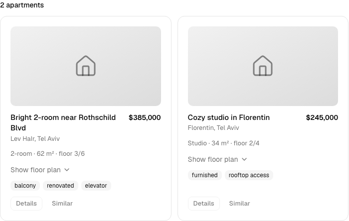
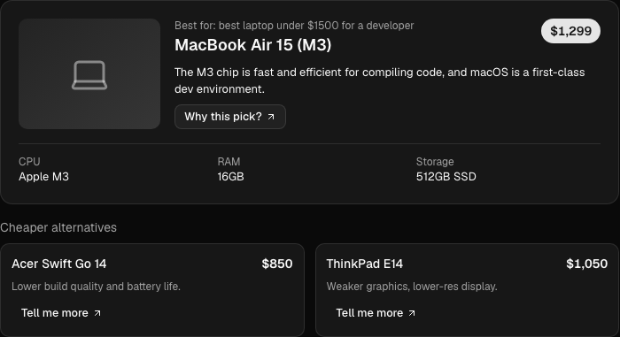
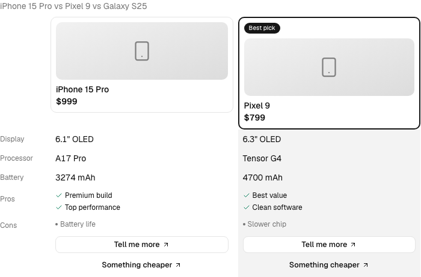
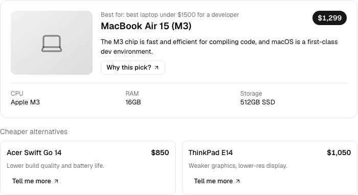
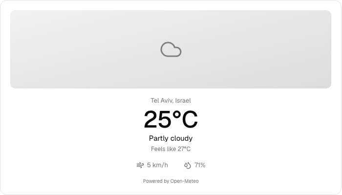
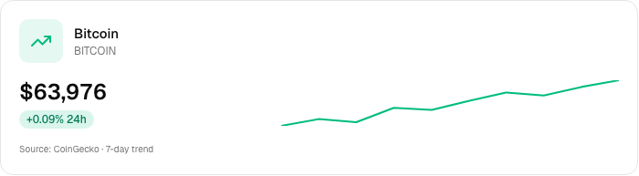
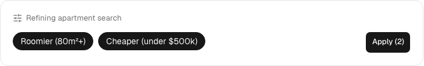

# GenWidget AI

> **AI chat that answers with live, interactive React widgets instead of walls of text.**
> Ask for apartments, compare phones, get a product recommendation — the model streams
> structured data through tool-calls and the UI renders it as a real widget.

[](https://github.com/Dtem4ik/genwidget-ai/actions/workflows/ci.yml)
[](tsconfig.json)
[](LICENSE)

**Live demo → [pet1.dtem4ik.dev](https://pet1.dtem4ik.dev)**

<!-- TODO: replace the stand-in shots below with docs/demo.gif once recorded
     (a screen capture: apartments → floor plan → weather → compare). -->

<p align="center">
  
  
</p>

## What makes this different

Most generative-UI demos ship two or three hardcoded toy widgets. This is built as a
**platform**:

- 🏗️ **A widget platform, not a toy demo** — each domain is a self-contained pack; adding a new one is a documented ~30-minute task.
- 🔄 **Streaming tool-calls** — a widget's fields fill in as the model generates them (skeleton → data → interactive), not a spinner then a text dump.
- 🧩 **LLM as the data source** — the model generates realistic content as the tool arguments; `execute()` just validates with zod. No catalogs to maintain.
- 🔁 **Widgets talk back** — buttons inside a widget send follow-up turns into the chat, so the widget is part of the conversation (UI → AI → UI).
- 🎨 **No fake photos** — gradient cards with domain icons instead of misleading stock images (honest and clean).
- ♿ **Accessible** — WCAG 2.1 AA pass: keyboard-operable, screen-reader labels, both themes, 375px mobile.
- 🔌 **Provider-agnostic** — switch the model in one line; runs on free-tier Gemini today.

## The 6 widgets

| Preview                                                                                    | Widget                  | Domain      | Data                       |
| ------------------------------------------------------------------------------------------ | ----------------------- | ----------- | -------------------------- |
|      | `ApartmentResults`      | Real estate | LLM-generated + floor plan |
|             | `CompareTable`          | Any product | LLM-generated              |
|  | `ProductRecommendation` | Any product | LLM-generated              |
|              | `WeatherCard`           | Weather     | Open-Meteo API (live)      |
|                  | `StockCard`             | Finance     | CoinGecko / Yahoo (live)   |
|              | `FilterChips`           | UI state    | LLM-generated              |

All 6 MVP widgets are live, in both themes. LLM-generated widgets render plausible (not
real) listings; the weather and price widgets use real free, keyless APIs.

## How it streams

The model returns _arguments for a tool_, not the widget. The AI SDK streams those args
as partial JSON; `useChat()` exposes them as `message.parts`; a registry maps the tool
name to a React component that renders by state — **skeleton → fields fill in →
interactive**. Buttons in the widget call `ask()` to send a new turn, closing the
UI → AI → UI loop. Full diagrams in **[docs/architecture.md](docs/architecture.md)**.

**Data pattern ([ADR-003](docs/adr/adr-003-llm-generated-data.md)):** for domains with no
free real-time API, the model generates the data as the tool-call arguments and
`execute()` is a zod-validated passthrough. Genuinely real-time domains (weather, stocks)
use live free APIs. No stock photos — gradient + icon
([ADR-004](docs/adr/adr-004-no-stock-photos.md)).

## How it stays free

💰 **$0/mo** at any traffic — four layers, cheapest-first ([ADR-005](docs/adr/adr-005-cost-strategy.md)):

- **Auto-demo on landing** — a scripted scenario plays from hardcoded data, so most visitors see the wow with **no API calls**.
- **10 messages/day per IP** via Upstash Redis (free tier) — caps any single visitor against the model's ~500/day pool.
- **Bring your own key** — past the limit, paste your own free Google AI Studio key; it stays in your browser and runs on your quota.
- **Response cache** — the suggested prompts are cached 24h and replay instantly.

## Try it

Open **[pet1.dtem4ik.dev](https://pet1.dtem4ik.dev)** and paste any of these:

- `2-bedroom apartments in Tel Aviv under $400k`
- `compare iPhone 15 Pro vs Pixel 9 vs Galaxy S25`
- `best laptop under $1500 for a developer`
- `what's the weather in Tel Aviv?`
- `bitcoin price`
- `something roomier and cheaper`

## Stack

Next.js (App Router) · TypeScript (strict) · Vercel AI SDK · zod · Tailwind · shadcn/ui ·
motion · Vitest · Playwright · GitHub Actions · Gemini (free tier) · deployed on Vercel.

**Live APIs:** Open-Meteo (weather, keyless) · CoinGecko + Yahoo Finance (prices, keyless).

## Run locally

```bash
pnpm install
pnpm dev          # dev server
pnpm test         # vitest (component tests)
pnpm e2e          # playwright e2e (mocks the LLM; runs against the prod build)
pnpm lint         # eslint
pnpm typecheck    # tsc --noEmit
pnpm build        # production build
pnpm screenshots  # regenerate docs/screenshots (dev tool, not in CI)
```

Set `GOOGLE_GENERATIVE_AI_API_KEY` in `.env.local` (see [`.env.example`](.env.example)).
Upstash vars are optional — rate-limit and cache silently no-op without them.

## AI-maintainability

The repo is built to be maintained _by_ an agent: [`CLAUDE.md`](CLAUDE.md) (architecture
map + rules), [`docs/adr/`](docs/adr/) (decision records), and
[`docs/adding-a-widget.md`](docs/adding-a-widget.md) (a new widget is one folder + two
one-line registrations).

## Roadmap

- **Coming: runs natively inside Claude as an [MCP App](https://modelcontextprotocol.io/)** — the same widgets rendered in Claude / Claude Desktop via `ui://` resources and a postMessage tool-call loop.
- More domain packs (cars, games, smart home, …), added one at a time after each is polished.

## License

[MIT](LICENSE)
