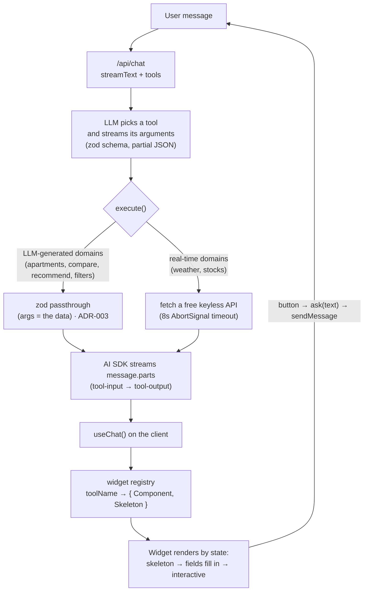
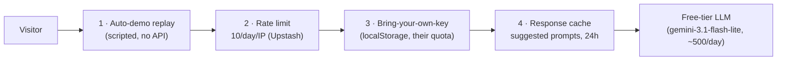

# Architecture

GenWidget AI turns a chat turn into a **streaming, interactive React widget**. The model
never returns the widget — it returns _structured arguments_ for a tool, and the client
maps that tool to a component that renders as the data streams in.

## The request → widget flow

The widget → chat arrow is the **UI → AI → UI loop**: buttons inside a widget
(`Tell me more`, `Something cheaper`, filter `Apply`) send a follow-up turn back into the
chat via `useWidgetActions().ask()`, so the widget is part of the conversation, not a dead end.

## Streaming states

Each tool part moves through states the registry renders directly (`ToolWidget`):

| AI SDK part state                     | What renders                           |
| ------------------------------------- | -------------------------------------- |
| `input-streaming` / `input-available` | the widget **skeleton** (shell parity) |
| `output-available`                    | the **widget component** with data     |
| `output-error`                        | the shared **error card**              |

Because the skeleton and the loaded card render through the same shell
(`WidgetCard`, `components/widgets/primitives.tsx`), nothing shifts size when data swaps in.

## Adding a domain

A widget is a self-contained pack — `widgets/<name>/{schema, tool, component, skeleton,
test, fixtures}` — plus one line in `lib/ai/tools.ts` and one in
`components/widgets/registry.tsx`. TypeScript correlates the tool's input/output with its
component. See [adding-a-widget.md](adding-a-widget.md). Target: ~30 minutes.

## Staying free ($0/mo)

Four cheapest-first layers keep the public demo at $0 regardless of traffic
([ADR-005](adr/adr-005-cost-strategy.md)):

Live-data tools (weather, stocks) are never cached — they must stay real-time. Rate-limit
and cache no-op gracefully when Upstash isn't configured (local dev, CI).
